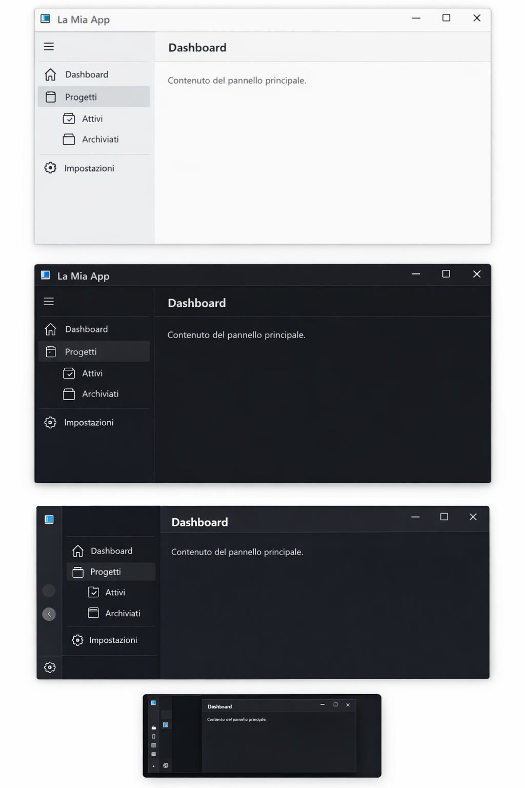

# 🧭 NavigationView per WinForms (WinFormsNavView)
WinUI3-style NavigationView control for WinForms (.NET 10)


Un controllo di navigazione laterale moderno, ispirato a **Fluent Design / WinUI 3**, scritto interamente in C# per **Windows Forms**.  
Offre un'esperienza utente pulita, prestazioni elevate e un'architettura modulare pronta per l'estensione.

---

## 📑 Indice

- [✨ Funzionalità](#-funzionalità)
- [🖥️ Anteprima](#️-anteprima)
- [📦 Requisiti](#-requisiti)
- [🚀 Installazione & Utilizzo](#-installazione--utilizzo)
- [🏗️ Architettura](#️-architettura)
- [🎨 Personalizzazione](#-personalizzazione)
- [🛠️ Note Tecniche](#️-note-tecniche)
- [🤝 Contribuire](#-contribuire)
- [📄 Licenza](#-licenza)

---

## ✨ Funzionalità

- 🎨 **Tema Chiaro/Scuro** integrato, con palette colori centralizzata e modificabile
- 📐 **Modalità di visualizzazione**: `Left` (fisso) e `LeftCompact` (solo icone, si espande dinamicamente)
- 🌳 **Menu gerarchico** con supporto accordion (espansione/collasso ricorsivo)
- 📌 **Footer ancorato** stabilmente in basso, indipendente dal numero di voci
- 🖼️ **Area contenuto neutrale** con ridimensionamento automatico e header opzionale
- ⚡ **Rendering ottimizzato**: doppio buffer GDI+, hit-testing preciso, zero flickering
- 🔌 **Architettura estensibile**: separazione netta tra layout, rendering e modello dati (`INavViewRenderer`)

---

## 🖥️ Anteprima



---

## 📦 Requisiti

- **.NET 10**
- **Windows** (WinForms)
- Font: `Segoe Fluent Icons`

---

## 🚀 Installazione & Utilizzo

1. Clona la repository o scarica i file `.cs`
2. Aggiungi il progetto `NavView` alla tua soluzione
3. Compila e usa il controllo

### Esempio Rapido

```csharp
var nav = new NavigationView
{
    AppTitle = "La Mia App",
    Theme = NavViewTheme.Light,
    PaneDisplayMode = PaneDisplayMode.LeftCompact
};

nav.MenuItems.Add(new NavItem { Label = "Dashboard", IconGlyph = FluentIcons.Dashboard });

this.Controls.Add(nav);
nav.Dock = DockStyle.Fill;
```

---

## 🏗️ Architettura

| File | Responsabilità |
|------|----------------|
| `NavigationView.cs` | Controller principale |
| `NavViewRenderer.cs` | Rendering |
| `NavViewColors.cs` | Temi |
| `NavItem.cs` | Modello dati |

---

## 🎨 Personalizzazione

```csharp
var myColors = NavViewColors.Dark();
myColors.ItemSelectedAccent = Color.Gold;
nav.Renderer.Colors = myColors;
```

---

## 🛠️ Note Tecniche

- Performance ottimizzate
- Rendering fluido
- Layout modulare

---

## 🤝 Contribuire

1. Fork
2. Branch
3. Commit
4. Push
5. Pull Request

---

## 📄 Licenza

MIT License

---

💡 Realizzato per la community WinForms
